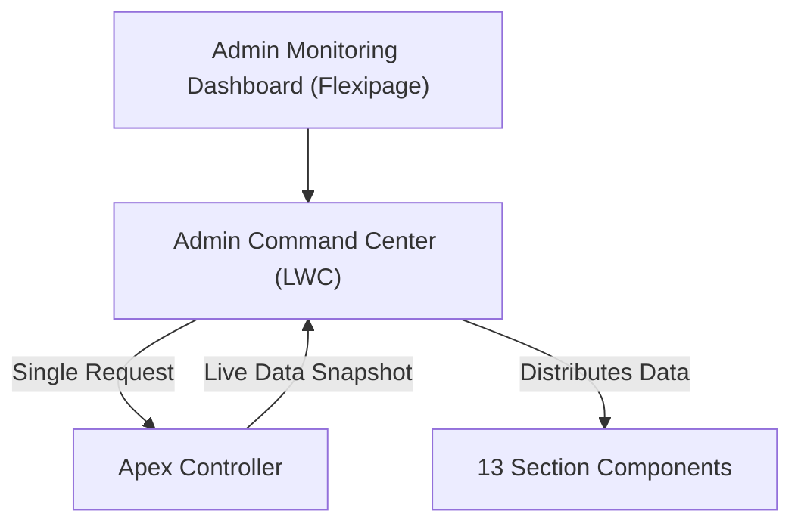
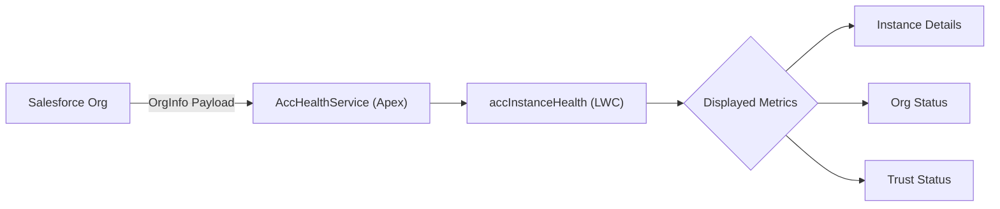
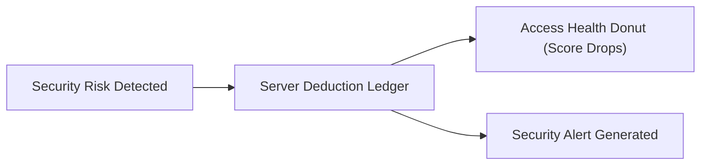
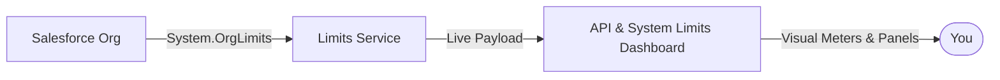
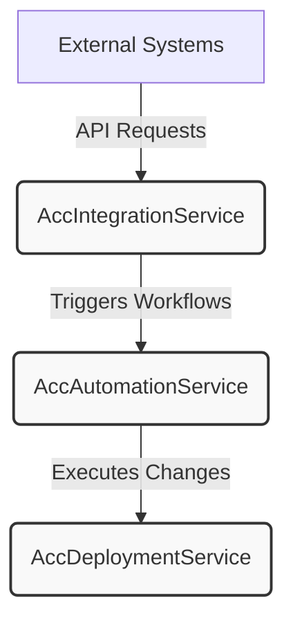

# Navigating the Admin Dashboard

The Admin Command Center is your central hub for monitoring the health, alerts, and overall status of your Salesforce organization. This guide explains the underlying architecture and layout of the dashboard, helping you understand how it delivers lightning-fast, reliable insights.

## Architecture Overview

To ensure high performance and a consistent view of your data, the Admin Command Center is built with a highly optimized data-fetching strategy.


Instead of having multiple dashboard widgets request their own data independently, the main component makes **exactly one** call to the server. It grabs a complete snapshot of your live org data and distributes it to the dashboard's 13 individual sections.



### Why a single snapshot?

Because all numbers on the page are computed server-side simultaneously, you never have to worry about data mismatch between different sections of the dashboard. There is no client-side mocking—what you see is a true, unified reflection of your org at that exact moment.

## Dashboard Layout

The dashboard is housed on a custom Lightning page (Flexipage) named **Admin Monitoring Dashboard**.

To maximize screen real estate and keep the focus entirely on your monitoring metrics, the page uses a streamlined layout:

| Component | Details |
|---|---|
| **Page Type** | Home Page |
| **Template** | `industries_common:homeTemplateOneRegion` (Single Region) |
| **Main Component** | `adminCommandCenter` Lightning Web Component (LWC) |

<Card title="Single-Region Design" icon="pi pi-desktop">

By using a single-region template, the Admin Command Center has full control over the layout of its 13 internal sections, ensuring a responsive and cohesive experience across different screen sizes.

</Card>

## Built-in Resilience and Accessibility

The dashboard is designed to be robust and accessible to all administrators.

### Error Handling and Retries

If a network hiccup occurs while loading the dashboard snapshot, the component handles it gracefully. It displays a clear error message (falling back to a default "Unable to load the Admin Command Center" if the server doesn't provide a specific reason) and provides a built-in **Retry** mechanism to attempt the data fetch again without refreshing the entire page.

### Screen Reader Support

<Info>
  **Assistive Technology Ready**  
  The dashboard is fully optimized for screen readers. It generates a comprehensive, hidden text summary of the page state so that visually impaired users get immediate context without having to tab through all 13 sections.
</Info>

When the dashboard loads, assistive technologies will automatically announce a summary containing:

- Your Salesforce Instance ID
- The overall system health status
- The exact number of critical alerts
- The timestamp of the last data update

## Under the Hood

For developers or admins curious about the underlying code, the data fetching logic is handled by the `AccAdminCommandCenterController.getDashboard` Apex method.

Here is a simplified look at how the main component requests and manages this data:

```javascript
import { LightningElement } from "lwc";
import getDashboard from "@salesforce/apex/AccAdminCommandCenterController.getDashboard";

export default class AdminCommandCenter extends LightningElement {
  payload;
  error;
  isLoading = true;

  connectedCallback() {
    this.load();
  }

  load() {
    this.isLoading = true;
    this.error = undefined;
    
    // Single round-trip to fetch all dashboard data
    getDashboard()
      .then((result) => {
        this.payload = result;
      })
      .catch((error) => {
        this.error = error;
      })
      .finally(() => {
        this.isLoading = false;
      });
  }
}
```

<Tip>
  Because the dashboard relies on a single Apex controller (`AccAdminCommandCenterController` running on API version 67.0), ensure that any admin users who need to view this dashboard have the appropriate Apex class access granted in their profile or permission sets.
</Tip>

# Monitoring the Instance Health

The Instance Health component gives you a real-time snapshot of your organization's platform status and environment details. Use this dashboard to quickly verify your current release, environment type, and overall instance connectivity.

## Available Health Metrics

When you view the Instance Health component, you will see several key pieces of information about your organization. This data is pulled directly from your org's live payload.

| Metric | Description |
|---|---|
| **Instance ID** | The unique identifier for your specific server instance (e.g., NA123). |
| **Environment** | The type of environment you are currently viewing (e.g., Production, Sandbox). |
| **Release** | The current release version active on your instance. |
| **Org Status** | Indicates whether the platform successfully served the health request. |
| **Salesforce Trust** | The official security and performance status from Salesforce. |
| **Instance URL** | The direct, underlying URL to your specific instance. |
| **My Domain** | Your organization's custom branded login URL. |

## Understanding Status Indicators

It is important to understand how the component calculates and displays your health status, as different metrics measure different things.

### Org Status vs. Weighted Health

The **Org Status** indicator simply confirms that the platform is active and successfully served the current request.

<Note>
  The Org Status is independent of the overall "weighted instance health score" that you might see in the main hero header of your dashboard. Org Status is a simple "up/down" check for the current request.
</Note>

### Salesforce Trust Status

The component attempts to display your official Salesforce Trust status. However, because retrieving this data requires an external API callout, you might see different visual states:

- **Healthy / Verified:** The external callout succeeded and Salesforce Trust reports no issues.
- **Data Unavailable:** The external callout was not made or could not be reached. The system will safely default to an informational "Data Unavailable" state rather than falsely assuming the instance is verified.

<Card title="Salesforce Trust" icon="pi pi-shield" href="https://trust.salesforce.com">

Visit the official Salesforce Trust website for comprehensive, global platform status and maintenance schedules.

</Card>

## How It Works (For Developers)

If you are customizing your monitoring dashboards, the Instance Health UI is powered by the `accInstanceHealth` Lightning Web Component (LWC) and backed by the `AccHealthService` Apex class.



The LWC expects an `AccModel.OrgInfo` payload to populate the UI blocks. Here is an example of how the component structures the data blocks internally before rendering them to the screen:

```javascript
// Example of the internal block structure generated by the component
const blocks = [
  { id: "instanceId", label: "Instance ID", value: org.instanceId },
  { id: "environment", label: "Environment", value: org.environment, status: "healthy" },
  { id: "release", label: "Release", value: org.release },
  { id: "orgStatus", label: "Org Status", value: org.statusLabel, status: org.status }
  // ... Trust and URL blocks are appended dynamically
];
```

<Tip>
  If you are building custom monitoring tools, you can reuse the `AccHealthService` (API version 67.0) to fetch the same reliable `OrgInfo` payload used by this component.
</Tip>


# Reviewing the Security Alerts

The Security & Access Health dashboard provides a clear, real-time view of your system's security posture. By visualizing your security score and detailing specific vulnerabilities, you can quickly identify, understand, and resolve access issues.

## Understanding Your Security Score

The centerpiece of the dashboard is the **Access Health Donut**, which displays your overall Security Health Score. This score is calculated using a transparent "deduction ledger" on the server.

Instead of a black-box calculation, your score starts at a baseline (typically 100%), and points are deducted for specific security risks.



<Info>
  **Total Explainability**  
  Every single deduction in the ledger has a matching row in the **Security Alerts** list. If your score drops, you will always be able to see exactly why by looking at your alerts.
</Info>

## Reviewing and Managing Alerts

When your score decreases, your first step should be to review the active alerts. The dashboard organizes these alerts alongside your system inventory and subsystems.

<Steps>
  <Step title="Check your Access Health Donut">
    Log in to the dashboard and review your current Security Health Score. If the score is lower than expected, proceed to the alerts section.
  </Step>
  <Step title="Review the Security Alerts list">
    Scroll down to the **Security Alerts** table. Each row corresponds to a specific deduction from your health score.
  </Step>
  <Step title="Check Inventory and Subsystem status">
    Review the **Inventory** tiles and **Subsystems** list. If a specific security asset or subsystem is currently offline or unreachable, it will be visually flagged as unavailable.
  </Step>
</Steps>
### Alert Status Indicators

The dashboard uses visual cues to help you prioritize issues. Items in your inventory or alerts list may display different states based on their availability:

| Status | Visual Indicator | Description |
|---|---|---|
| **Active** | Standard text | The alert is active and the subsystem is reachable. |
| **Unavailable** | Grayed out / Strikethrough | The underlying service or inventory item cannot be reached to verify its status. |

<Warning>
  If an inventory tile is marked as **Unavailable**, the system cannot currently assess its security health. You should investigate connectivity to that subsystem immediately.
</Warning>

## Next Steps

Once you have identified the alerts impacting your score, you can begin remediation.

<Card title="Remediation Guidelines" icon="fa fa-shield" href="#">

Learn best practices for resolving common access alerts and restoring your security score to 100%.

</Card>

---

## For Developers: Component Architecture

If you are a developer customizing the Salesforce Lightning environment, you can interact directly with the underlying Lightning Web Component (LWC).

<Accordion>
  <AccordionTab title="Understanding the accSecurityHealth Component" >

    The dashboard is powered by the `accSecurityHealth` LWC. It accepts a single `@api data` property, which expects an `AccModel.SecuritySection` payload from the `AccSecurityService` Apex class.
    Here is an example of the expected JSON structure for the `data` payload:
    ```json
    {
      "donut": {
        "score": 85,
        "label": "Good"
      },
      "alerts": [
        {
          "id": "AL-101",
          "message": "Overly permissive profile detected",
          "deduction": 10,
          "unavailable": false
        }
      ],
      "inventory": [
        {
          "name": "User Authentication",
          "unavailable": false
        }
      ],
      "subsystems": []
    }
    ```
    The component automatically applies specific CSS classes (like `acc-unavailable`) to alerts and inventory items when their `unavailable` flag is set to `true`.

  </AccordionTab>

</Accordion>

# Tracking System Limits

Keeping track of your system and API limits is crucial for maintaining a healthy application environment. The **API & System Limits** dashboard provides a real-time, visual breakdown of your current usage against your organization's maximum thresholds.

By monitoring these limits, you can proactively identify bottlenecks and prevent service interruptions before they happen.

## How the dashboard works

The dashboard pulls live data directly from your organization's system limits and translates it into easy-to-read visual indicators.



The interface is divided into two main sections to help you understand your usage at a glance:

<Card title="Usage Meters" icon="pi pi-chart-line">

Visual progress bars that calculate your current usage percentage (Current / Maximum × 100). Hover over any bar to see exact numbers.

</Card>

<Card title="Status Panel" icon="pi pi-server">

A detailed, row-by-row breakdown of individual limits. It automatically highlights any services that are currently unavailable or exhausted.

</Card>

## Monitoring your limits

Follow these steps to check your organization's current health and capacity:

<Steps>
  <Step title="Navigate to the dashboard">
    Open your Core Monitoring Dashboard and locate **Section 7 - API & System Limits**.
  </Step>
  <Step title="Review the Usage Meters">
    Glance at the horizontal progress bars. Each bar represents a specific system limit. The wider the bar, the closer you are to hitting your maximum capacity.
  </Step>
  <Step title="View exact usage details">
    Hover your mouse over any progress bar. A tooltip will appear showing exactly how much capacity you have consumed (for example: *"45,000 of the 100,000 API Requests limit used"*).
  </Step>
  <Step title="Check the Status Panel">
    Look at the detailed panel below the meters. If any limit has been exceeded or a specific service is down, the value will be highlighted to grab your attention.
  </Step>
</Steps>
<Tip>
  Make it a habit to check this dashboard before executing large data imports or deploying major updates that might consume a high volume of API calls.
</Tip>

## Understanding status indicators

When reviewing the Status Panel, you may occasionally see limits flagged as unavailable. Here is what those indicators mean:

| Status Appearance | Meaning | Action Required |
|---|---|---|
| **Standard Text** | The limit is active and you have remaining capacity. | None. Everything is operating normally. |
| **Highlighted/Red Text** | The limit is exhausted or the specific service is temporarily unavailable. | Review your recent system activity to identify what consumed the limit. |
| **Dashboard Unavailable Message** | The entire limits dashboard cannot load data. | Check the provided `unavailableReason` message on the screen for specific details. |

<Warning>
  If you reach 100% of your API request limit, external integrations and applications relying on the API will fail until the limit resets or is increased.
</Warning>

## Frequently asked questions

<Accordion>
  <AccordionTab title="Why is the entire dashboard showing as 'Unavailable'?" >

    If the dashboard cannot fetch the live data payload, it will display an unavailable state. This usually includes an **Unavailable Reason** on the screen. Common causes include temporary network disruptions or insufficient permissions to read organizational limits.

  </AccordionTab>

  <AccordionTab title="How often does the limit data refresh?" >

    The dashboard displays a live payload sourced directly from your system's organizational limits at the moment the page loads. Refresh your browser to fetch the most up-to-date numbers.

  </AccordionTab>

  <AccordionTab title="Can I change my maximum limits from this dashboard?" >

    No, this dashboard is strictly for monitoring. If you need to increase your organizational limits, you will need to contact your system administrator or account executive.

  </AccordionTab>

</Accordion>

# Managing Backend Services

This page provides technical reference details for the core backend Apex services powering your environment. These services handle deployment, automation, and integration tasks, ensuring your system runs smoothly and communicates effectively with external platforms.

<Card title="Deployment" icon="pi pi-cloud">

Manages configuration rollouts and package deployments across your environments.

</Card>

<Card title="Automation" icon="pi pi-cog">

Handles background jobs, scheduled tasks, and internal workflow triggers.

</Card>

<Card title="Integration" icon="pi pi-sync">

Facilitates secure communication and data syncing with external third-party APIs.

</Card>

## Core Services Overview

The backend architecture relies on three primary Apex classes. By default, these services are deployed and activated automatically.

| Service Name | Apex Class | API Version | Status |
|---|---|---|---|
| **Deployment Service** | `AccDeploymentService` | 67.0 | Active |
| **Automation Service** | `AccAutomationService` | 67.0 | Active |
| **Integration Service** | `AccIntegrationService` | 67.0 | Active |

<Note>
  All core backend services are currently standardized on Salesforce API version **67.0**. If you are building custom extensions, ensure your code is compatible with this API version.
</Note>

### Service Architecture

These services often work together to process complex requests. For example, an external system might trigger an integration, which in turn kicks off an automated deployment process.



## Verifying Service Status

If you are experiencing issues with background processes or external connections, you should first verify that these core services are active in your environment.

<Steps>
  <Step title="Access Setup">
    Log in to your Salesforce environment, click the gear icon in the top right, and select **Setup**.
  </Step>
  <Step title="Navigate to Apex Classes">
    In the Quick Find box on the left sidebar, type `Apex Classes` and select the matching result.
  </Step>
  <Step title="Locate the Services">
    Use the alphabetical index or search feature to find `AccDeploymentService`, `AccAutomationService`, and `AccIntegrationService`.
  </Step>
  <Step title="Confirm Active Status">
    Click into each class and verify that the **Status** field is set to `Active`. If any service is inactive, edit the class and update its status.
  </Step>
</Steps>
## Metadata Configuration

Under the hood, each service is defined by an XML metadata file that dictates its version and status. If you are managing your Salesforce configuration via source control (like Git), the metadata for these services will look like this:

```xml
<?xml version="1.0" encoding="UTF-8" ?>
<ApexClass xmlns="http://soap.sforce.com/2006/04/metadata">
    <apiVersion>67.0</apiVersion>
    <status>Active</status>
</ApexClass>
```

<Warning>
  Never manually downgrade the `<apiVersion>` in your source control repository. Doing so can cause deployment failures if the Apex class relies on features exclusive to version 67.0.
</Warning>

## Frequently Asked Questions

<Accordion>
  <AccordionTab title="Can I change the API version of these services?" >

    While it is technically possible to update the API version in the class metadata, we strongly recommend keeping all three services synchronized on version 67.0. Updating them independently may lead to unexpected behavior or integration failures.

  </AccordionTab>

  <AccordionTab title="What happens if a service status becomes Inactive?" >

    If any of these core services are marked as Inactive, the related processes will immediately stop functioning. For example, an inactive `AccIntegrationService` will cause all incoming API requests to be rejected. Always ensure these classes remain Active in production environments.

  </AccordionTab>

</Accordion>
